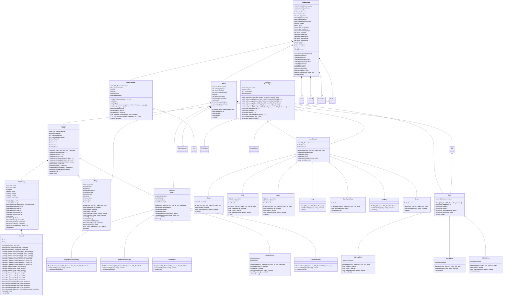

```mermaid
classDiagram

%% Game Object Hierarchy
class GameObject {
    <<abstract>>
    +static SDL_Rect screen
    +Texture texture
    +SDL_Rect hitBox
    +bool isRemoved
    +static bool AABB(const SDL_Rect& A, const SDL_Rect& B) bool
    +static int OverhangRight(const SDL_Rect& A, const SDL_Rect& B) int
    +static int OverhangLeft(const SDL_Rect& A, const SDL_Rect& B) int
    +static int OverhangUp(const SDL_Rect& A, const SDL_Rect& B) int
    +static int OverhangDown(const SDL_Rect& A, const SDL_Rect& B) int
    +static bool JumpedOnHead(const SDL_Rect& player, const SDL_Rect& enemy) bool
    +virtual void Update(float dt) = 0
    +virtual void Render() = 0
    +virtual void Reset() = 0
    +virtual void TouchedBy(Entity* entity) = 0
    +SDL_Rect& HitBox() SDL_Rect&
    +virtual void UpdateDestRect()
}

class Block {
    +static SDL_Texture* textures
    +Block(SDL_Rect, SDL_Rect, SDL_Rect, bool)
    +virtual void Update(float dt)
    +virtual void Render()
    +virtual void Reset()
    +virtual void TouchedBy(Entity* entity)
    +virtual void Limit(Entity* entity)
    +virtual ~Block()
}

class HiddenBlock {
    -bool playAnimation
    +HiddenBlock(SDL_Rect, SDL_Rect, SDL_Rect)
    +void Reset() override
    +void TouchedBy(Entity* entity) override
    +~HiddenBlock()
}

class BrickBlock {
    -bool playAnimation
    +BrickBlock(SDL_Rect, SDL_Rect, SDL_Rect)
    +void TouchedBy(Entity* entity) override
    +~BrickBlock()
}

class MysteryBlock {
    -bool playAnimation
    +MysteryBlock(SDL_Rect, SDL_Rect, SDL_Rect)
    +void Render() override
    +void Reset() override
    +void TouchedBy(Entity* entity) override
    +~MysteryBlock()
}

class Entity {
    <<abstract>>
    +static SDL_Texture* textures
    -RigidBody rigidBody
    -SDL_Rect spawnPoint
    -SDL_Rect previousPosition
    -bool hasCollided
    -bool recoverX
    -bool recoverY
    -bool faceLeft
    -bool playSound
    +Entity(SDL_Rect, SDL_Rect, SDL_Rect, bool)
    +virtual void Update(float dt) = 0
    +virtual void Render() = 0
    +virtual void Reset() = 0
    +virtual void Touch(GameObject* object) = 0
    +virtual void TouchedBy(Entity* entity) = 0
    +virtual void LimitedBy(GameObject* object)
    +bool IsDead() const bool
    +bool HasCollided() const bool
    +RigidBody& GetRigidBody() RigidBody&
    +virtual void UpdatePreviousPosition()
    +virtual void Kill() = 0
    +virtual ~Entity()
}

class Player {
    +static int position
    -int deathCount
    -bool isGiga
    -bool isForcedByFlag
    -int bottomOfFlag
    -bool onGround
    -bool jump
    -Timer jumpTime
    -bool runSprite
    -float runTime
    +Player(SDL_Rect, SDL_Rect, SDL_Rect)
    +void Update(float dt) override
    +void Render() override
    +void Reset() override
    +void Touch(GameObject* object) override
    +void TouchedBy(Entity* entity) override
    +void Kill() override
    +void MakeGiga()
    +void SetBottomOfFlag(int y)
    +bool IsForcedByFlag() const bool
    +bool& OnGround() bool&
    +SDL_Rect& SpawnPoint() SDL_Rect&
    +~Player()
}

class Enemy {
    <<abstract>>
    -bool faceLeftDefault
    -bool isActivated
    -int activationPoint
    -int shiftTextureRight
    +Enemy(SDL_Rect, int, SDL_Rect, int, SDL_Rect, bool)
    +virtual void Update(float dt)
    +virtual void Render()
    +virtual void Reset()
    +virtual void Touch(GameObject* object)
    +virtual void TouchedBy(Entity* entity) = 0
    +virtual void Kill()
    +~Enemy()
}

class CommonEnemy {
    +CommonEnemy(SDL_Rect, int, SDL_Rect, int, SDL_Rect, bool)
    +void TouchedBy(Entity* entity) override
    +~CommonEnemy()
}

class SoldierEnemy {
    -bool isSqueezed
    -bool isSliding
    +SoldierEnemy(SDL_Rect, int, SDL_Rect, int, SDL_Rect, bool)
    +void Update(float dt) override
    +void Reset() override
    +void TouchedBy(Entity* entity) override
    +bool IsSqueezed() const bool
    +~SoldierEnemy()
}

class KingEnemy {
    +KingEnemy(SDL_Rect, int, SDL_Rect, int, SDL_Rect, bool)
    +void TouchedBy(Entity* entity) override
    +~KingEnemy()
}

class RedMushroomEnemy {
    +RedMushroomEnemy(SDL_Rect, int, SDL_Rect, int, SDL_Rect, bool)
    +void TouchedBy(Entity* entity) override
    +~RedMushroomEnemy()
}

class PurpleMushroomEnemy {
    +PurpleMushroomEnemy(SDL_Rect, int, SDL_Rect, int, SDL_Rect, bool)
    +void TouchedBy(Entity* entity) override
    +~PurpleMushroomEnemy()
}

%% Level Elements
class LevelElement {
    +static SDL_Texture* textures
    -bool isActivated
    -bool playSound
    +LevelElement(SDL_Rect, SDL_Rect, SDL_Rect)
    +virtual void Update(float dt)
    +virtual void Render()
    +virtual void Reset()
    +virtual void TouchedBy(Entity* entity)
    +virtual ~LevelElement()
}

class Cloud {
    -int shiftTextureRight
    +Cloud(SDL_Rect, SDL_Rect, SDL_Rect, int)
    +void Render() override
    +void TouchedBy(Entity* entity) override
    +~Cloud()
}

class Fish {
    -SDL_Rect spawnPoint
    -int activationPoint
    -bool faceUp
    +Fish(SDL_Rect, SDL_Rect, SDL_Rect, int, bool)
    +void Update(float dt) override
    +void Reset() override
    +void TouchedBy(Entity* entity) override
    +~Fish()
}

class Laser {
    -SDL_Rect spawnPoint
    -int activationPoint
    -bool faceLeft
    +Laser(SDL_Rect, SDL_Rect, SDL_Rect, int, bool)
    +void Update(float dt) override
    +void Reset() override
    +void TouchedBy(Entity* entity) override
    +~Laser()
}

class Tube {
    +Tube(SDL_Rect, SDL_Rect, SDL_Rect)
    +void TouchedBy(Entity* entity) override
    +~Tube()
}

class CheckpointFlag {
    -bool isReached
    +CheckpointFlag(SDL_Rect, SDL_Rect, SDL_Rect)
    +void TouchedBy(Entity* entity)
    +~CheckpointFlag()
}

class EndFlag {
    +EndFlag(SDL_Rect, SDL_Rect, SDL_Rect)
    +void TouchedBy(Entity* entity) override
    +~EndFlag()
}

class House {
    -bool isReached
    +House(SDL_Rect, SDL_Rect, SDL_Rect)
    +void TouchedBy(Entity* entity) override
    +~House()
}

%% Core Systems
class GameEngine {
    +static RenderWindow* window
    +const static int frameDelay
    +static int frameTime
    -bool anyKeyPressed
    -Transition transition
    -std::unique_ptr<Level> level
    -Level::Type currentLevel
    -Level::Type nextLevel
    -Level::Type completedLevels
    -bool exitProgram
    -bool isPaused
    -Scene::Type currentScene
    -Scene::Type nextScene
    -Language currentLanguage
    -std::vector<LanguageModule*> LangMod
    -TextButton* titleButton
    -TextButton* deathButton
    -std::vector<Button*> menuButtons
    -std::vector<Button*> gameButtons
    -Sound sounds
    -Texture titleScreen
    -Texture menuScreen
    -Input input
    -Uint32 frameStart
    +GameEngine(RenderWindow&)
    +void ApplyEvenFPS()
    +void HandleEvents()
    +void HandlePressedKeys()
    +void HandleSceneChanges()
    +void UpdateButtons()
    +void UpdateGame()
    +void RenderItems()
    +void ApplyTransition()
    +void LogScenes() const
    +bool GetExitProgram() const bool
    +~GameEngine()
}

class RenderWindow {
    +static SDL_Renderer* renderer
    -SDL_Window* window
    -int width
    -int height
    -Font latinFonts
    -Font japaneseFonts
    +RenderWindow(const char*, int, int)
    +void Clear()
    +void Display()
    +void RenderText(std::string, int, int, Colour, FontType, Language)
    +void DrawBackground(int, int, int)
    +void ApplyTransition(int)
    +int GetWidth() const int
    +int GetHeight() const int
    +SDL_Renderer* GetRenderer() SDL_Renderer*
    +TTF_Font* GetFont(FontType, Language) TTF_Font*
    +~RenderWindow()
}

class Level {
    +static bool isCompleted
    -std::unique_ptr<Player> player
    -std::vector<std::unique_ptr<Enemy>> enemies
    -std::vector<std::unique_ptr<Enemy>> tempEnemies
    -Grid grid
    -std::vector<std::unique_ptr<LevelElement>> elements
    -CoinAnimation animation
    -Quote quote
    -Enemy* enemyWithQuote
    -std::unique_ptr<TextButton> quoteButton
    -int maxCameraX
    +Level(std::string, RenderWindow*, int)
    +void Update(float dt)
    +void Render()
    +void Reset()
    +~Level()
}

%% Utility Classes
class Vector2D {
    +float x
    +float y
    +Vector2D(float=0.0f, float=0.0f)
    +bool operator==(const Vector2D&) const bool
    +bool operator!=(const Vector2D&) const bool
    +Vector2D operator+(const Vector2D&) const Vector2D
    +Vector2D operator-(const Vector2D&) const Vector2D
    +Vector2D operator*(const Vector2D&) const Vector2D
    +Vector2D operator/(const Vector2D&) const Vector2D
    +Vector2D& operator+=(const Vector2D&) Vector2D&
    +Vector2D& operator-=(const Vector2D&) Vector2D&
    +Vector2D& operator*=(const Vector2D&) Vector2D&
    +Vector2D& operator/=(const Vector2D&) Vector2D&
    +Vector2D operator+(float) const Vector2D
    +Vector2D operator-(float) const Vector2D
    +Vector2D operator*(float) const Vector2D
    +Vector2D operator/(float) const Vector2D
    +Vector2D& operator+=(float) Vector2D&
    +Vector2D& operator-=(float) Vector2D&
    +Vector2D& operator*=(float) Vector2D&
    +Vector2D& operator/=(float) Vector2D&
    +friend Vector2D operator+(float, const Vector2D&)
    +friend Vector2D operator-(float, const Vector2D&)
    +friend Vector2D operator*(float, const Vector2D&)
    +friend Vector2D operator/(float, const Vector2D&)
    +friend std::ostream& operator<<(std::ostream&, const Vector2D&)
    +void Log() const
    +~Vector2D()
}

class RigidBody {
    +static float gravity
    +static float scale
    -float mass
    -Vector2D force
    -Vector2D position
    -Vector2D velocity
    -Vector2D acceleration
    +RigidBody(float=1.0f)
    +void Update(float dt)
    +const Vector2D& GetPosition() const Vector2D&
    +void ApplyForce(Vector2D F)
    +void ApplyForceX(float Fx)
    +void ApplyForceY(float Fy)
    +void ApplyVelocityX(float vx)
    +void ApplyVelocityY(float vy)
    +void Reset()
    +float& Mass() float&
    +Vector2D& Force() Vector2D&
    +Vector2D& Position() Vector2D&
    +Vector2D& Velocity() Vector2D&
    +Vector2D& Acceleration() Vector2D&
    +~RigidBody()
}

%% Inheritance Relationships
GameObject <|-- Block
GameObject <|-- Entity
GameObject <|-- LevelElement

Block <|-- HiddenBlock
Block <|-- BrickBlock
Block <|-- MysteryBlock

Entity <|-- Player
Entity <|-- Enemy

Enemy <|-- CommonEnemy
Enemy <|-- SoldierEnemy
Enemy <|-- KingEnemy
Enemy <|-- RedMushroomEnemy
Enemy <|-- PurpleMushroomEnemy

LevelElement <|-- Cloud
LevelElement <|-- Fish
LevelElement <|-- Laser
LevelElement <|-- Tube
LevelElement <|-- CheckpointFlag
LevelElement <|-- EndFlag
LevelElement <|-- House

%% Composition/Usage Relationships
GameEngine "1" *-- "1" Level
GameEngine "1" *-- "1" RenderWindow
GameEngine "1" *-- "1" Input
GameEngine "1" *-- "1" Sound
GameEngine "1" *-- "1" Transition
GameEngine "1" *-- "*" Button

Level "1" *-- "1" Player
Level "1" *-- "*" Enemy
Level "1" *-- "1" Grid
Level "1" *-- "*" LevelElement
Level "1" *-- "1" CoinAnimation

Grid "1" *-- "*" Block

Entity "1" *-- "1" RigidBody
RigidBody "1" *-- "1" Vector2D

RenderWindow "1" *-- "1" Font
Button <|-- TextButton
Button <|-- ImageButton
```